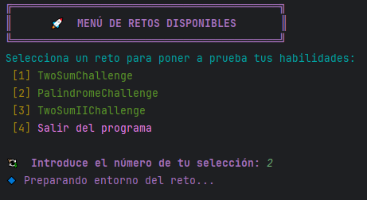
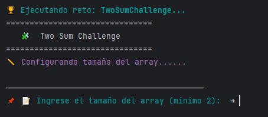
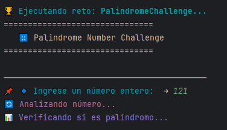

<div align="center">
  <h2>
    Desafíos de Programación 📩
  </h2>

<p align="center">
    <!-- Insignias para Discord-Message con color morado -->
    <a href="https://github.com/Dev-Asfix/Logic-Challenges?tab=License-1-ov-file"></a>
        <a href="https://github.com/Dev-Asfix/Logic-Challenges/issues">
        
    </a>
    <a href="https://github.com/Dev-Asfix/Logic-Challenges/graphs/contributors">
        
    </a>
</p>
</div>

<div align="center">
  
  
  
  
  
  
  
  

  
</div>

Este repositorio contiene soluciones optimizadas para tres desafíos comunes de algoritmos:
El código sigue principios sólidos de **Programación Orientada a Objetos (POO)**, asegurando un diseño limpio, escalable y mantenible:

 ### 🔹 Características principales:

💠 Sistema basado en POO (Programación Orientada a Objetos) para una estructura clara y escalable.  
💠 Menú dinámico que permite seleccionar y ejecutar retos fácilmente.  
💠 Modularidad total: Se pueden agregar más desafíos sin alterar la lógica central.  
💠 Ejecución rápida y eficiente, ideal para practicar algoritmos y mejorar habilidades en Java.

### 🔹 Retos implementados:
1. **Palindrome Number** (Número Palíndromo)
2. **Two Sum** (Dos Números que Suman un Objetivo)
3. **Two Sum II** (Dos Números que Suman un Objetivo - Array Ordenado)

<!-- Tabla para organizar imágenes -->
<table width="100%">
  <tr>
    <!-- Columna izquierda: Imagen de información -->
    <td align="left" width="60%">
      
    </td>
    <td align="right" width="60%">
      
      <br><br>
      
    </td>
  </tr>
</table>

Cada solución emplea estrategias eficientes para resolver los problemas de manera óptima.

---

## 1️⃣ Palindrome Number
### 📌 Descripción
Dado un número entero, determinar si es un palíndromo (es decir, si se lee igual de izquierda a derecha y viceversa).

### 🛠️ Estrategia Utilizada
- Evita convertir el número en una cadena para reducir el uso de memoria.
- Solo se invierte la mitad del número para mejorar la eficiencia.
- Se descartan casos imposibles desde el inicio (números negativos y múltiplos de 10 excepto 0).

### 💡 Código
```java
public class PalindromeSolver {
    public boolean isPalindrome(int x) {
        if (x < 0 || (x % 10 == 0 && x != 0)) return false;

        int halfReversed = 0;
        while (x > halfReversed) {
            halfReversed = halfReversed * 10 + x % 10;
            x /= 10;
        }
        return (x == halfReversed || x == halfReversed / 10);
    }
}
```

### 🚀 Beneficios del Código
- **Optimización de memoria**: No utiliza una conversión a string.
- **Eficiencia**: Solo recorre la mitad del número.
- **Robustez**: Maneja casos especiales correctamente.

---

## 2️⃣ Two Sum
### 📌 Descripción
Dado un array de enteros y un número objetivo, encontrar dos números que sumen dicho objetivo y devolver sus índices.

### 🛠️ Estrategia Utilizada
- Utiliza un doble bucle anidado para verificar todas las combinaciones posibles.
- Retorna los índices en cuanto encuentra la primera coincidencia.

### 💡 Código
```java
public class TwoSumSolver {
    public int[] findTwoSum(int[] nums, int target) {
        for (int i = 0; i < nums.length; i++) {
            for (int j = i + 1; j < nums.length; j++) {
                if (nums[j] == target - nums[i]) {
                    return new int[]{i, j};
                }
            }
        }
        return new int[]{};
    }
}
```

### 🚀 Beneficios del Código
- **Simplicidad**: Fácil de entender e implementar.
- **Correctitud**: Encuentra la solución en todos los casos posibles.
- **Uso básico de memoria**: No requiere estructuras adicionales.

📌 *Nota:* Este algoritmo tiene una complejidad **O(n²)**. Para una mejor eficiencia, se puede mejorar con un mapa hash (**O(n)**).

---

## 3️⃣ Two Sum II (Array Ordenado)
### 📌 Descripción
Versión optimizada de **Two Sum**, en la que el array está ordenado de forma ascendente. Debemos encontrar dos números que sumen el objetivo y retornar sus posiciones (basadas en 1).

### 🛠️ Estrategia Utilizada
- Implementa el método de **dos punteros** para mejorar la eficiencia.
- Se inicia con dos punteros: uno al inicio y otro al final del array.
- Se ajustan los punteros en función de la suma actual comparada con el objetivo.

### 💡 Código
```java
public class TwoSumIISolver {
    public int[] findTwoSumII(int[] numbers, int target) {
        int left = 0, right = numbers.length - 1;
        while (left < right) {
            int sum = numbers[left] + numbers[right];
            if (sum == target) {
                return new int[]{left + 1, right + 1}; // Base 1
            } else if (sum < target) {
                left++;
            } else {
                right--;
            }
        }
        return new int[]{};
    }
}
```

## 📂 Estructura del Proyecto

```bash
📦 challenges
 ┣ 📂 Palindrome
 ┃ ┣ 📜 PalindromeChallenge.java  # Clase principal del reto de palíndromos
 ┃ ┗ 📜 PalindromeSolver.java     # Lógica para verificar números palíndromos
 ┣ 📂 TwoSum
 ┃ ┣ 📜 TwoSumChallenge.java      # Clase principal del reto Two Sum
 ┃ ┗ 📜 TwoSumSolver.java         # Algoritmo para encontrar dos números que sumen un objetivo
 ┣ 📂 TwoSum_II
 ┃ ┣ 📜 TwoSumIIChallenge.java    # Clase principal del reto Two Sum II
 ┃ ┗ 📜 TwoSumIISolver.java       # Algoritmo optimizado con dos punteros
📦 core
 ┣ 📜 BaseChallenge.java          # Es la Abstract Class
 ┣ 📜 Challenge.java              # Interfaz
 ┗ 📜 ChallengeSelector.java       # Aqui podemos añadir mas retos
📦 utils
 ┣ 📂 validation_errors           # Exceptions
 ┣ 📜 ConsoleColors.java          # Utilidad para agregar colores en la consola
 ┣ 📜 InputValidator.java         # Validación de entradas del usuario
 ┗ 📜 LoadingUtils.java           # Animaciones de carga para una mejor experiencia
📜 README.md                      # Documentación del proyecto
```

## 🛠️ Instalación y Configuración

Sigue estos pasos para clonar y ejecutar el proyecto en tu entorno local:

### 1️⃣ Clonar el Repositorio
Abre una terminal y ejecuta el siguiente comando:

```bash
git clone https://github.com/Dev-Asfix/Logic-Challenges.git
```
### 2️⃣ Acceder al Proyecto
Navega dentro del directorio del proyecto:

```bash
cd Logic-Challenges   
```
### 3️⃣ Compilar y Ejecutar
Asegúrate de tener Java 17 o superior instalado. Luego, compila:
Si estás usando un IDE como IntelliJ IDEA o VS Code, simplemente abre el proyecto y ejecuta ChallengeRunner.java.


## 🚀 Cómo Usarlo


1. Selecciona un reto en el menú de la consola.
2. Sigue las instrucciones que aparecen en pantalla.
3. Ingresa los valores solicitados y recibe la solución calculada.
### 🏆 Menú Principal del Programa


### 🚀 Beneficios del Código
- **Mayor eficiencia**: Utiliza dos punteros, logrando una complejidad **O(n)**.
- **Menos memoria**: No usa estructuras adicionales.
- **Optimización sobre el algoritmo original** (Two Sum).

---

## 📌 Conclusión
- Cada solución está optimizada para su caso de uso específico.
- **PalindromeSolver** evita conversiones innecesarias y usa matemáticas simples.
- **TwoSumSolver** implementa una solución directa para encontrar dos números que suman el objetivo.
- **TwoSumIISolver** usa un enfoque de dos punteros para mejorar la eficiencia en arrays ordenados.

---

**Autor:** Pablo Aldair Rosas Ramírez  
📧 Email: [rosasramirez753@gmail.com](mailto:rosasramirez753@gmail.com)  
🔗 GitHub: [Dev Asfix](https://github.com/Dev-Asfix)  
💼 LinkedIn: [Pablo Rosas Ramirez](https://www.linkedin.com/in/pablo-rosas-dev/)

---

Hecho con ❤️ por Dev Asfix 🚀